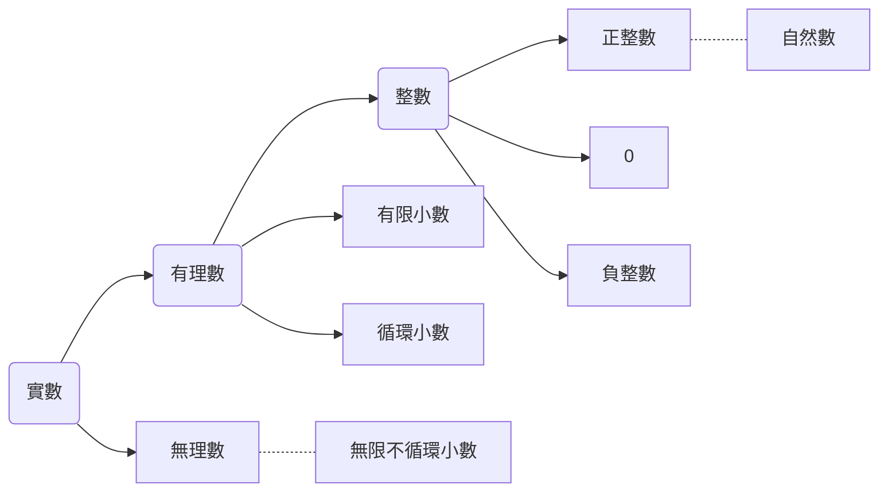

# 9_1to9_11
#數學
- 0$\in \mathbb{Q}$
	- $Pf: \frac{0}{1}=0$
- 有理數一定能化成有限小數、無限循環小數、或整數
	- $Pf:$ 令$x, n$為任意數
	     ${n}\div {x}$之餘數必在0~x之間
		 但除法可以除超過$x$次
		 =>有重複餘數=>必有重複結果=>為無限循環小數
		 若餘數為0，則為有限小數
- 循環節必在一數字之最後
	- $Pf:0. \overline{11}7$，最後一位到底是1還是7?
	- $0.\overline{9}=1$
	- $Pf:$ 令$x=$0.\overline{9}$
		=>$10x=9.\overline{9}$
		=>$10x-x=9x=9$
		=>$x=1$
- 有理數的封閉性
	- $Pf: P,Q\in \mathbb{Q}$
		$P+Q, P-Q, P*Q\in \mathbb{Q}$
		$\frac{P}{Q} or \frac {Q}{P} \in \mathbb{Q} (P,Q \neq 0)$
- 有理數之稠密性
	- 任兩相異有理數間，必可以找到另一相異有理數
- 任一數之標準分解式是唯一的
- 若任意數n不為完全平方數，則$\sqrt{n} \notin \mathbb{Q}$
- 實數系

- 令$a \in \mathbb{R}$，$\sqrt{a^2}=|a|$
- $\sqrt{ab}=\sqrt{a}\times\sqrt{b}$ ; $\sqrt{\frac{b}{a}}=\frac{\sqrt{b}}{\sqrt{a}}$
- $a^3+b^3=(a+b)(a^2-ab+b^2)$
- $a^3-b^3=(a-b)(a^2+ab+b^2)$
- $(a+b)^3=a^3-3a^2b+3ab^2+b^3$
- $(a+b+c)(a^2+b^2+c^2-ab-bc-ac)=a^3+b^3+c^3-3abc$
- 證明$\sqrt{2} \notin\mathbb{Q}$
	- $Pf:$ 用反證法  
		設$\sqrt{2}=\frac{n}{m}\in\mathbb{Q}(m,n\in\mathbb{N}$
		=>$n=\sqrt{2}m$
		=>$n^2=2m^2$
		$n^2$之標準分解式中，2之次方數為偶數
		$2m^2$之標準分解式中，2之次方數為奇數
		$\rightarrow\leftarrow$
		$\therefore\sqrt{2}\notin\mathbb{Q}$

#### 202109121619
		 