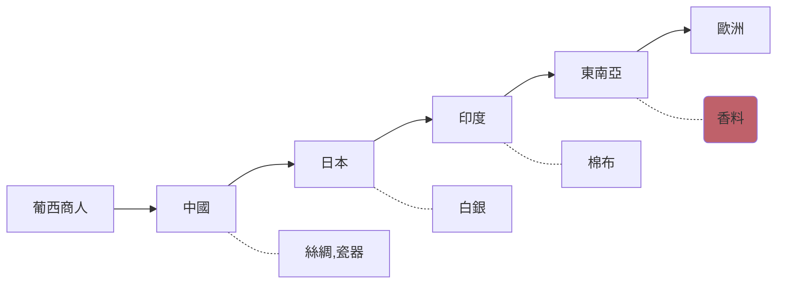

# 9_1~9_11
#歷史
- "*Ilha Formosa!*"
	- 葡萄牙語(美麗之島)
	- 去日本時途經台灣所發生之感嘆
		- 去傳教、貿易
			- 日本白銀產量世界No.2
			- 「堺」: 日本黑市
			- 原漢衝突
			- 
- 西方來東方貿易路線

- 1860s 列強侵墾
	- [[大南澳事件]](1868~1869)
	- [[必麒麟事件]](1863)
	- [[羅妹(發)號事件]](1867)
- 人種分類文明不文明?
	- 19th西方種族知識架構(1859達爾文進化論~WWI,WWII)
		- 清末胡適、梁啟超
			- 新中國運動 (Young China)
		- 日本1868明治維新
			- 議會制、工業化
			- 1938 大東亞共榮圈
- 日本人類學家
	- 為帝國目標服務
		- 伊能嘉矩
			- 四群八族
			- 1900 台灣蕃人事情
		- 粟野傳之丞
			- 1900 台灣蕃人事情
		- 鳥居龍藏 
- 1635 麻豆社事件
- 日本年號換算
	- 明治n年
		- 西元1867+n
	- 大正n年
		- 西元1911+n
	- 昭和n年
		- 西元1925+n
- 原住民正名運動
	- 1984 **原**住民**權**利促進**會**
	- 湯英伸案
		- 鄒族從曹族中脫離
	- 「我是誰」運動
	- 「還我土地」運動
	- 2004大選
		- 太魯閣族脫離
	- 李登輝拍板	
		- 確定正名為「原住民」
#### 202109121923