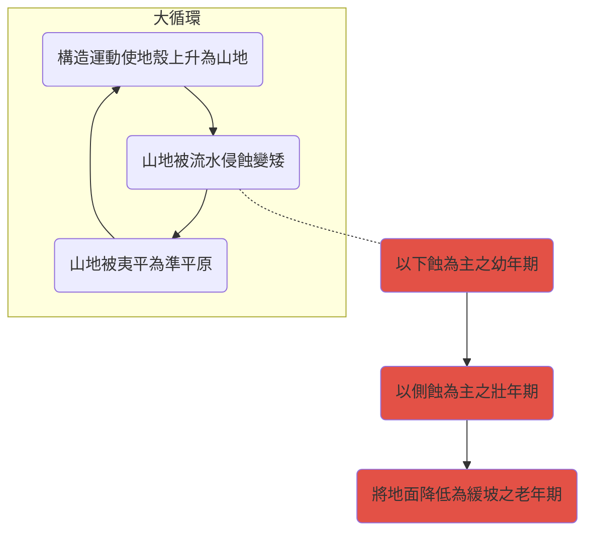

# 侵蝕輪迴論

- 又稱地理輪迴說、地貌輪迴說
- 提出: 威廉·莫里斯·戴維斯(USA)，1889
- 分為: 河流侵蝕輪迴、風蝕輪迴、冰蝕輪迴、海蝕輪迴
- 河流侵蝕輪迴內容: 

```mermaid
graph TD
subgraph 大循環
id1(構造運動使地殼上升為山地)-->id2(山地被流水侵蝕變矮)-->id3(山地被夷平為準平原)-->id1
end
id2-.-id4(以下蝕為主之幼年期)
id4-->id5(以側蝕為主之壯年期)-->id6(將地面降低為緩坡之老年期)
style id4 fill:#e35146
style id5 fill:#e35146
style id6 fill:#e35146
```

Links: [[準平原]]
#### 202108281943