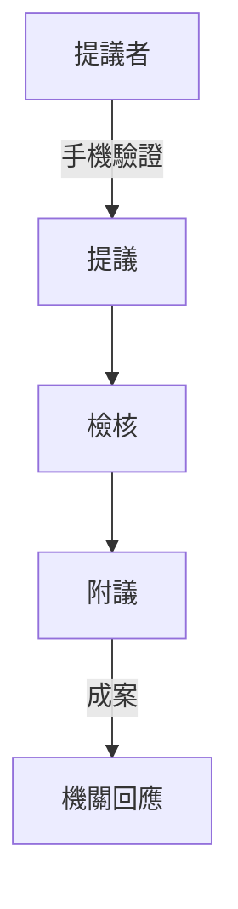

# 公共政策網路參與平台
#公民 #報告

### 架構
- **起源**
	- 參考白宮*We the People*網站
		- 透明開放
		- 公眾參與
		- 機關課責
	- 2015 年建置
- **架構**
	- 由中央政府機關(*行政院*)主導
	- 地方21縣市加入
		- 沒有嘉義縣
- **功能**
	- 政策諮詢
		- 眾開講
	- 重大施政計畫
		- 來監督
	- ==國民提議==
		- 提點子
	- 首長信箱
		- 找首長
	- 參與式預算
- **國民提議**
	- 提議者須登入驗證
	- 經過平台檢核
		- 不得違反刑法
		- 不得涉及宗教、種族議題
		- 不得侵犯他人法律權益
		- 屬於兩岸、國防、外交議題
		- 內容不得針對特定人事物
		- 不得為企業、廣告、網路虛擬人事物提案
	- 60日附議期
		- 附議者亦須經過手機簡訊認證
		- 須達到5000份附議
			- ==政府機關必須提出回應==
				- 即時回應
				- 綜整回應
					- 法律草案送[[立法院]]後十工作日內
					- 可延長至20日
	- *全國性選舉前60日暫停提議、附議*
- **爭議**
	- 提案水準參差不齊
		- 審查更嚴格?
			- 扼殺民意
		- 審查太嚴格?
			- 此問題更嚴重
	- 政府罐頭回應
		- > 政府會做就是會做，不會就是不會。
		- 被當作*人民的許願池*?

#### 202110161114

