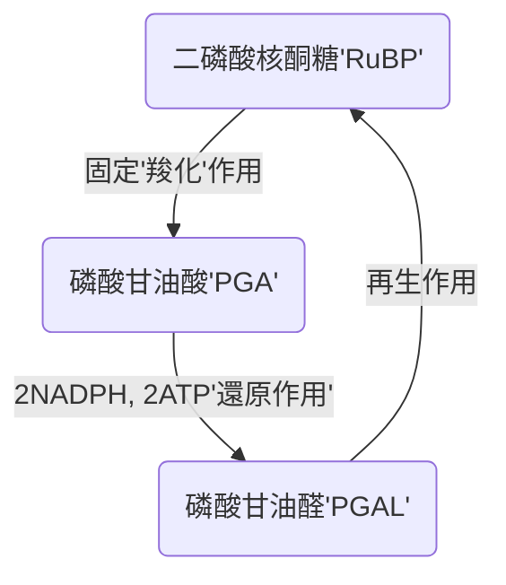

# 卡爾文循環
#生物
卡爾文循環是[[光合作用]]裡碳反應的一部分。循環可分為三個階段：羧化、還原和二磷酸核酮醣的再生。卡爾文循環每進行六次，生成一分子葡萄糖。
反應場所: 葉綠體內的基質。

```mermaid
graph TD
id1(二磷酸核酮糖'RuBP')
id2(磷酸甘油酸'PGA')
id3(磷酸甘油醛'PGAL')
id1-->|固定'羧化'作用|id2
id2-->|2NADPH, 2ATP'還原作用'|id3
id3-->|再生作用|id1

```

#### 202108252100
