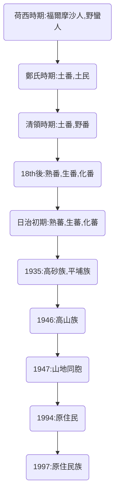

# 原住民名稱/分類
#歷史

### 歷史時代劃分

### 正名運動
- 1998曹族正名為**鄒族**
- 1998雅美族正名為**達悟族**
- 2001邵族脫離鄒族
- 2002噶瑪蘭族脫離阿美族
	- 隱身於阿美族之族人
	- 宜蘭平原之平埔族人
- 2004太魯閣族脫離泰雅族
- 2007撒奇萊雅族脫離阿美族
- 2008賽德克族脫離泰雅族
- 2014拉阿魯哇族脫鄒族
- 2014卡那卡那富族脫離鄒族
#### 202110101123