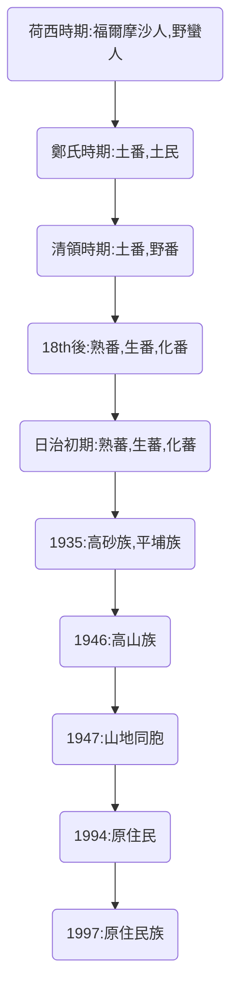

# 原住民名稱/分類
#歷史

```mermaid
graph TB
id1(荷西時期:福爾摩沙人,野蠻人)-->id2(鄭氏時期:土番,土民)-->id3(清領時期:土番,野番)-->id4(18th後:熟番,生番,化番)-->id5(日治初期:熟蕃,生蕃,化蕃)-->id6(1935:高砂族,平埔族)-->id7(1946:高山族)-->id8(1947:山地同胞)-->id9(1994:原住民)-->id10(1997:原住民族)
```

#### 202110101123