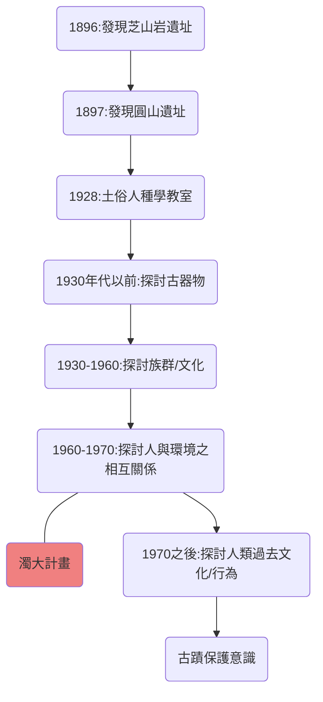

# 台灣考古學發展
#歷史
Topic: 台灣考古學發展
Date: 20210727
Course: 高健歷史
Class: 海山E學院

---
### Notes
- 19世紀末以前(到清領時期)，對台灣史前文化毫無所知

---
### Summary
Highlight     ==史前文化大考出題率低，抓大重點==

Link:[[濁大計畫]]

#### 202107271431