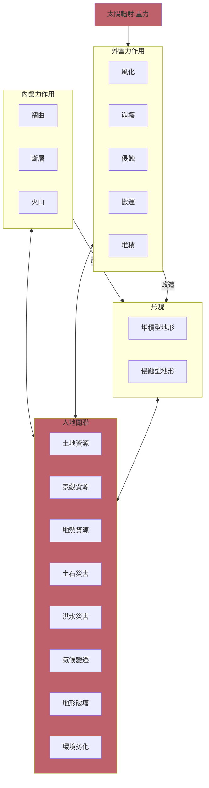

# 地形系統

```mermaid
flowchart TD
太陽輻射,重力-->外營力作用
subgraph 外營力作用
風化
崩壞
侵蝕
搬運
堆積
end
subgraph 形貌
堆積型地形
侵蝕型地形
end
subgraph 內營力作用
褶曲
斷層
火山
end
subgraph 人地關聯
土地資源
景觀資源
地熱資源
土石災害
洪水災害
氣候變遷
地形破壞
環境劣化
end
內營力作用-->|產生|形貌
外營力作用-->|改造|形貌
內營力作用<-->人地關聯
外營力作用<-->人地關聯
形貌<-->人地關聯
style 人地關聯 fill:#BF616A
style 太陽輻射,重力 fill:#BF616A
```