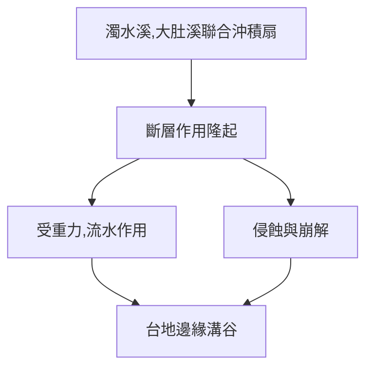
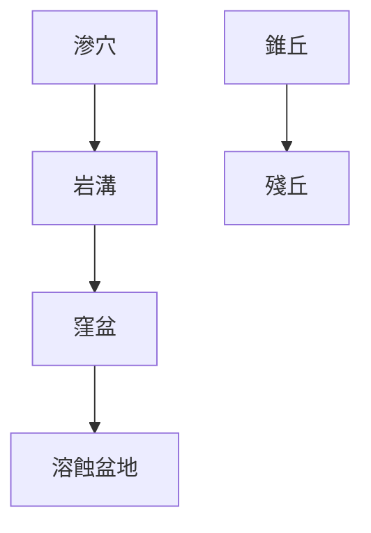

# 地理筆記
#地理

### 新褶曲 vs 古結晶
||新褶曲山脈|[[古老結晶陸塊]]|
|---|---|---|
|年代|距今 3500w 年內|距今 2 億 8000w 年內|
|受外營力作用時間|短|長|
|地表岩質|沉積岩|火成岩、變質岩|
|地表起伏|大|小|

### [[差異侵蝕]]
- [[豬背嶺]]
    - 因[[差異侵蝕]]形成，與[[單面山]]不同之處在於[[豬背嶺]]之硬岩層與侵蝕面幾乎垂直，導致露出地表之硬岩層面積小，形成山頂。
- [[單面山]]
    - 因[[差異侵蝕]]軟岩、硬岩差異所產生，與[[豬背嶺]]不同之處在於[[單面山]]之硬岩層幾乎平行侵蝕面，故露出大面積硬岩。

### [[斷層作用]]
- 岩層受力斷裂，被分為兩塊岩盤行錯動運動。
- 分類(依照岩盤相互運動方向):
    - 正斷層
        - 受到拉力
        - 上磐相對下磐向下移動
    - 逆斷層
        - 受到擠壓力
        - 上磐相對下磐向上移動
    - 錯動斷層
        - 受到剪力
        - 分為:
            - 左移斷層
                - 站在任一邊另一邊都向左移動
            - 右移斷層
                - 站在任一邊另一邊都向左移動
- [[地壘]]
- [[地塹]](Graben)
    - 由一系列正斷層連續分布形成
    - 中國 河西走廊
- [[斷層崖]]
    - [[斷層作用]]斷裂面之落差形成。
    - 高度:
        - 數十至數百、甚至數千公尺都有可能。
    - 花蓮 清水斷崖
- 能量以地震波的形式傳出。

### 火山作用
- 依照噴出地表與否

||侵入式火山|噴發式火山|
|---|---|---|
|類型|岩漿未噴出地表，僅侵入岩層|岩漿噴出地表|
|釋例|基隆山(後經侵蝕露出)|澎湖桶盤嶼|

- 噴發式火山依照岩漿成分

||寧靜式噴發|爆發式噴發|
|---|---|---|
|岩漿性質|基性岩漿|中、酸性岩漿|
|$SiO_2$含量|少|多|
|岩漿黏性|低|高|
|岩漿流動性|高|低|
|氣體散逸|易|不易|
|形成岩石|玄武岩|安山岩|
|形成地形|熔岩台地、高原|錐狀火山、火口湖|
|釋例|澎湖玄武岩台地區|維蘇威火山|

- 火山資源
    - 火山灰土壤
        - 富含礦物質
        - 利於農耕
    - 火山地熱
        - 暖氣
        - 發電
        - 溫室供熱
    - 硫化物
        - 火藥

### 風化作用
- 物理風化
    - 岩石在原地崩解
- 化學風化
    - 岩石與水、空氣發生化學反應
    - 成分改變->原地崩解

### 崩壞作用

![[Pasted image 20211120182429.png]]
![[Text Elements.png]]
- 潛移
    - 大範圍緩慢下滑
    - 肉眼不易察覺
    - 判斷
        - 樹幹底部彎曲
        - 電線杆飄移
- 地滑
    - 岩屑、土壤沿地層或地下水面向下滑動
    - 與山崩相較範圍較大
- 土石流
    - 混合石塊、沙礫、土壤的流動體
    - 條件
        - 降水豐富
        - 土石鬆散
        - 坡度陡峭
    - 發生速度快
    - 發生部
        - 防災:水泥格樑
    - 流動部
        - 防災:攔沙壩
    - 堆積部
        - 多為山麓沖積扇
        - 防災:引流道
- 山崩/落石
    - 石塊沿斜坡急速崩落/直接自由落體
    - 與地滑相比範圍較小

### [[地形系統]]釋例-八卦台地

### 河流侵蝕輪迴
![[404.excalidraw.png]]
- 動力來源:侵蝕、板塊抬升
- 重大問題:未考慮中下游地形差異

### 冰河地形
- 冰蝕
	- 懸谷瀑布
		- ![[Ex-211120-220.excalidraw.png]]
		- 支流落差大->下蝕力較強

### 沖積扇 Alluvial Fan
![[Ex-211120-2220.excalidraw.png]]
- 為土石流堆積部
- 扇頂、扇央
	- 堆積物顆粒較大
		- 透水性佳
		- 地下水補注區
	- 果園為主
- 扇端
	- 地下水帶狀滲出
		- 湧泉帶
	- 水稻種植為主
	- 屏東萬巒 五溝水地區

### 曲流 Meander
- 谷曲流
	- 河川沿地形彎曲
- 自由曲流
	- 地勢平坦開闊-->河川亂流
	- 核心
		- 截彎取直
	- 名詞
		- 凸岸
			- 滑走坡
			- 堆積旺盛
			- 相對利於農耕
		- 凹岸
			- 基蝕坡
			- 侵蝕旺盛
			- 河水較深
				- 河港
	- 牛軛湖
		- 截彎取直後剩下的河道
		- 大部分會乾涸

### [[石灰岩地形]](喀斯特地形)
- 石灰岩溶於水
$$CaCO_3+H_2O+CO_2 \rightarrow Ca(HCO_3)_{2(aq)}$$
- 水中石灰岩析出
$$Ca(HCO_3)_{2}\rightarrow CaCO_{3(s)}+H_2O+CO_2$$
- 等高線多內凹
	- ![[Ex-211121-1051.excalidraw.png]]
- 地形
	- 滲穴 Doline Sinkhole
	- 岩溝 Lapies/grike
	- 錐丘
	- 窪盆 Uvala
	- 溶蝕盆地 Poije
		- 多有河流流經，堆積旺盛
			- 壩子
			- 少數適宜人居之地
	- 殘丘 Hum
	- 溶蝕洞穴
		- 鐘乳石 Stalacite
		- 石筍 Stalagmite
		- 石柱 Limestone Column

### 風成地形
- 風蝕作用
	- 礫漠
	- 岩漠
- 風積作用
	- 沙丘(沙質沙漠)
		- 新月丘
		- 橫沙丘
		- 縱沙丘
	- 黃土原
		- 適宜農業
		- 德國波蘭黃土平原
		- 渭河盆地

### 海水作用
- 海蝕地形
- 海積地形

#Canon EOS 600D(2011)
#Canon EF-S 18-135mm f/3.5-5.6
#SIGMA 28mm f1.8
#Made in Japan