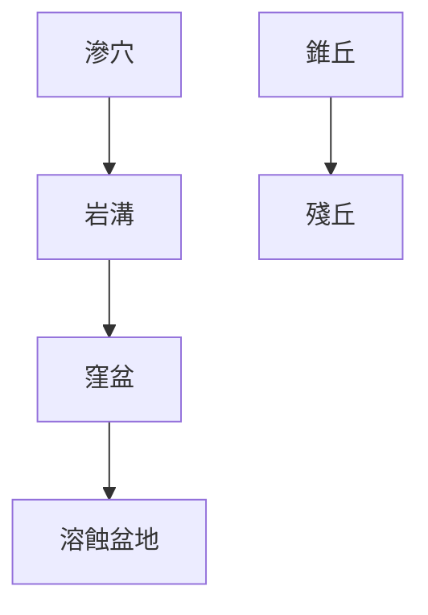

# 地理筆記
### 河流侵蝕輪迴
![[404.excalidraw.png]]
- 動力來源:侵蝕、板塊抬升
- 重大問題:未考慮中下游地形差異

### 冰河地形
- 冰蝕
	- 懸谷瀑布
		- ![[Ex-211120-220.excalidraw.png]]
		- 支流落差大->下蝕力較強

### 沖積扇 Alluvial Fan
![[Ex-211120-2220.excalidraw.png]]
- 為土石流堆積部
- 扇頂、扇央
	- 堆積物顆粒較大
		- 透水性佳
		- 地下水補注區
	- 果園為主
- 扇端
	- 地下水帶狀滲出
		- 湧泉帶
	- 水稻種植為主
	- 屏東萬巒 五溝水地區

### 曲流 Meander
- 谷曲流
	- 河川沿地形彎曲
- 自由曲流
	- 地勢平坦開闊-->河川亂流
	- 核心
		- 截彎取直
	- 名詞
		- 凸岸
			- 滑走坡
			- 堆積旺盛
			- 相對利於農耕
		- 凹岸
			- 基蝕坡
			- 侵蝕旺盛
			- 河水較深
				- 河港
	- 牛軛湖
		- 截彎取直後剩下的河道
		- 大部分會乾涸

### [[石灰岩地形]](喀斯特地形)
- 石灰岩溶於水
$$CaCO_3+H_2O+CO_2 \rightarrow Ca(HCO_3)_{2(aq)}$$
- 水中石灰岩析出
$$Ca(HCO_3)_{2}\rightarrow CaCO_{3(s)}+H_2O+CO_2$$
- 等高線多內凹
	- ![[Ex-211121-1051.excalidraw.png]]
- 地形
	- 滲穴 Doline Sinkhole
	- 岩溝 Lapies/grike
	- 錐丘
	- 窪盆 Uvala
	- 溶蝕盆地 Poije
		- 多有河流流經，堆積旺盛
			- 壩子
			- 少數適宜人居之地
	- 殘丘 Hum
	- 溶蝕洞穴
		- 鐘乳石 Stalacite
		- 石筍 Stalagmite
		- 石柱 Limestone Column

### 風成地形
- 風蝕作用
	- 礫漠
	- 岩漠
- 風積作用
	- 沙丘(沙質沙漠)
		- 新月丘
		- ![[Ex-211121-2058.excalidraw.png]]
		- 橫沙丘
		- ![[Ex-211121-2219.excalidraw.png]]
		- 縱沙丘
		- ![[Ex-211121-2217.excalidraw.png]]
	- 風積黃土區
		- 適宜農業
		- 德國波蘭黃土平原
		- 渭河盆地

### 海水作用
- ![[Ex-211121-2227.excalidraw.png]]
- 海蝕地形
	- 海蝕洞
	- 海蝕門(海拱)
	- 海蝕柱
	- 海蝕崖
	- 海蝕凹壁
	- 海蝕平台
- 海積地形
	- 分布在沙岸地區
		- 潮埔
			- 適合養蚵
		- 沙嘴
			- 與陸地相連的沙洲前沿
			- 沿海流方向延伸
		- 沙灘
		- 濱外沙洲
			- 潟湖
				- 適合養蚵
- 沉水海岸
	- 峽灣
		- 冰河地形
	- 谷灣
		- 山谷地形
- 離水海岸

