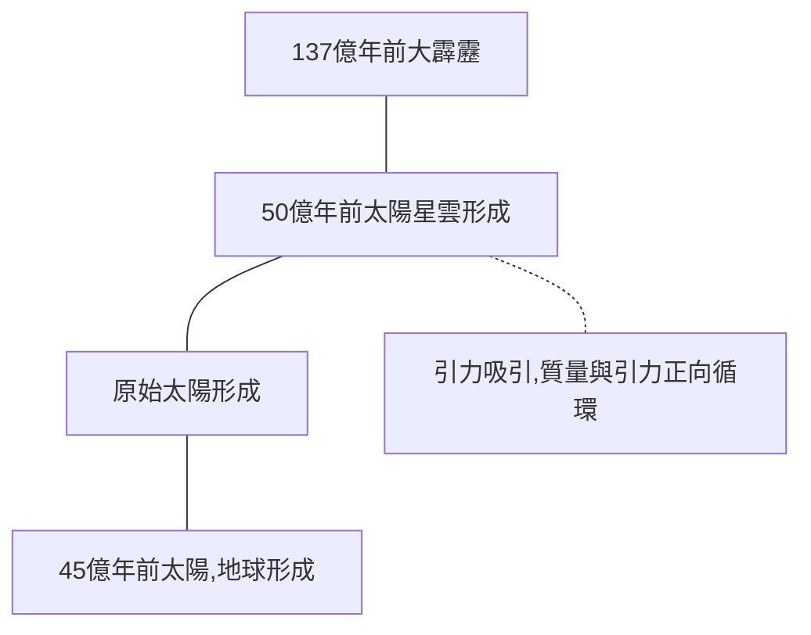

# 太陽星雲說
#地科

```mermaid
graph TD
137億年前大霹靂---50億年前太陽星雲形成---原始太陽形成---45億年前太陽,地球形成
50億年前太陽星雲形成-.-引力吸引,質量與引力正向循環
```
- 旋轉力：太陽受銀河引力，使各天體有繞太陽旋轉之動力
- [[核融合]]：
	- 成因：太陽質量過大，造成引力塌縮
	- 多為He,H
- 證據：
	- 類地、類木行星之分別(太陽風作功，無法把較重之物質吹太遠)
	- 固體行星上有許多坑洞（引力吸引撞擊）
	- 行星繞太陽公轉