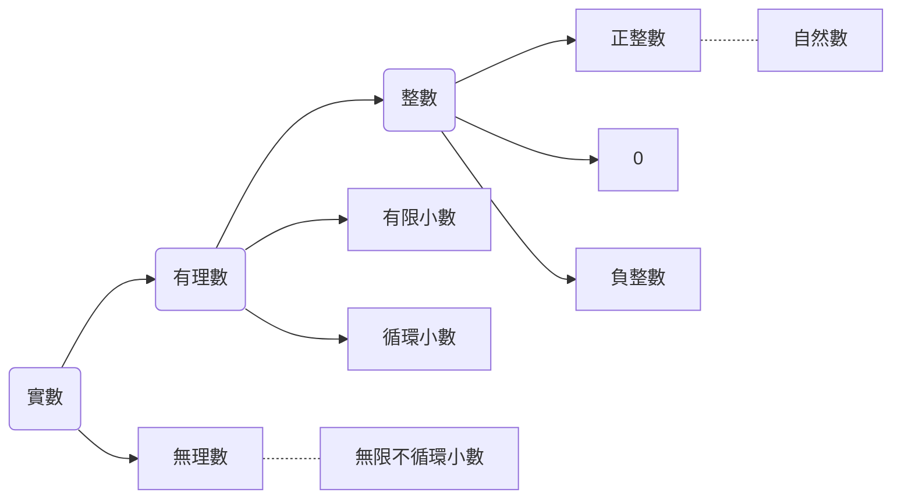

# 實數
#數學

- 實數系

- 0$\in \mathbb{Q}$
	- $Pf: \frac{0}{1}=0$ 
- 循環節必在一數字之最後
	- $Pf:0. \overline{11}7$，最後一位到底是1還是7?
	- $0.\overline{9}=1$
	- $Pf:$ 令$x=$0.\overline{9}$
		=>$10x=9.\overline{9}$
		=>$10x-x=9x=9$
		=>$x=1$
- 任一數之標準分解式是唯一的
- 若任意數n不為完全平方數，則$\sqrt{n} \notin \mathbb{Q}$
- 令$a \in \mathbb{R}$，$\sqrt{a^2}=|a|$
- $\sqrt{ab}=\sqrt{a}\times\sqrt{b}$ ; $\sqrt{\frac{b}{a}}=\frac{\sqrt{b}}{\sqrt{a}}$
- 證明$\sqrt{2} \notin\mathbb{Q}$
	- $Pf:$ 用反證法  
		設$\sqrt{2}=\frac{n}{m}\in\mathbb{Q}(m,n\in\mathbb{N}$
		=>$n=\sqrt{2}m$
		=>$n^2=2m^2$
		$n^2$之標準分解式中，2之次方數為偶數
		$2m^2$之標準分解式中，2之次方數為奇數
		$\rightarrow\leftarrow$
		$\therefore\sqrt{2}\notin\mathbb{Q}$

#### 202109121619
		 