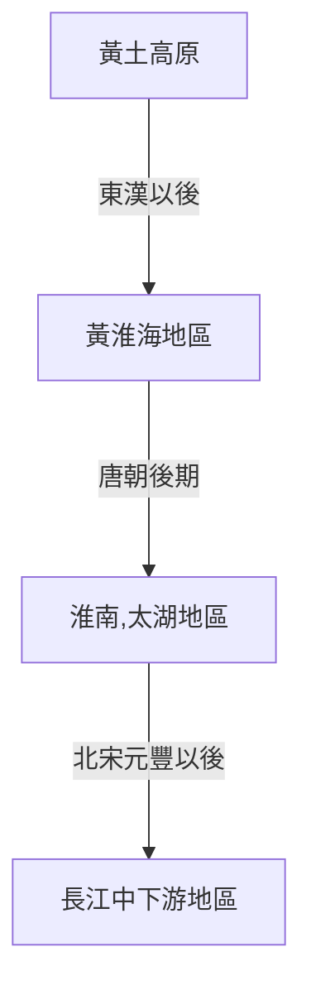

# 歷史L3筆記
### 人口移動的原因:
- 氣候變遷
- 人為戰亂
	- 勞力、資金、技術
	- 中國:==由西到東到南==
- 政策
- 經濟移民
	- 流寇

### 遊牧民族
- 五胡(先秦~東漢末->==隋唐:新漢族==)
	- 匈奴
	- 鮮卑
	- 羯
	- 氐
	- 羌
- 唐
	- 突厥
	- 吐蕃
	- 回紇 
- 宋
	- 契丹
	- 黨項羌
	- 女真
- 蒙古
- 女真

### 漢朝
- 刺史->州牧
	- 可以自行募兵
	- 地方割據

### 征服vs滲透
- 滲透王朝
	- 中國境內少數民族建立==中國式==政權
	- 十六國、西夏、北朝
- 征服王朝
	- 成立的政權以自身文化為主
	- 實施二元統治
	- 表現在文字上
	- 遼、金、元、清
	- 對漢文化主動選擇
		- 遼、元傾向抵制
		- 金、清傾向吸收

### 北朝的政權(滲透王朝)
- 北魏的中央化建置
	- 均田制
	- 三長制
- 胡漢衝突與消融
	- 北魏漢化運動(5th後期)
		- 遷都洛陽
		- 禁胡服
		- 斷北語
		- 改姓氏(國姓)
		- 通婚姻
		- 將上層階級分姓
			- 鮮卑八姓
			- 漢人四姓
			- 不入姓族被排斥在門閥之外
				- 六鎮之亂(平城亂)
	- 爾朱榮之亂
		- 影響東魏、西魏成立
	- 西魏:
		- 府兵制
			- 胡漢兵團
		- 西魏關隴集團
	- 東魏:大鮮卑主義(表面)
		- 繼承六鎮反漢化
	- 山東郡姓
		- 謹守儒家文化的北方漢人
		- 顏氏家訓

### 元朝差別待遇
- 任官
	- 重要職位由蒙古人擔任
- 科舉
	- 左榜、右榜
- 法律
	- 因罪犯所屬族群不同而有極大差別
- 武裝
	- 漢人、南人不准擁有武器

### 對待投降民族
- 唐
	- 唐太宗vs突厥
		- 建立安西都護府
		- 保留突厥原有文化、部落制度
		- 被尊為天可汗
- 明
	- 明太祖vs蒙古
		- 蒙古人真正漢化
		- 禁胡服、胡語、胡俗、胡姓
		- 不許與同族人通婚
- 清
	- 漢族
		- 恩威並施
			- 恩:禮遇明朝遺臣、科舉
			- 威:禁結盟社、文字獄
	- 蒙古
		- 聯盟、招降
		- 以蒙旗制度限制範圍
	- 西藏
		- 畫分四大教區
		- 政教分離
	- 西南
		- 改土歸流
	- 邊疆少數民族
		- 理蕃院

### 經濟重心南移

- 南移三時期(人口、經濟中心、文教)
	- 西晉末
		- ==永嘉之禍==311
	- 唐中後
		- ==安史之亂==755
	- 北宋末
		- ==靖康之禍==1127
	- 新耕地與新作物
		- 平原->山坡、沙地、貧瘠、濱海
		- 梯田、圩田、圍田、湖田
			- 與水爭地
			- 與山爭地
		- 作物
			- 早熟稻(60~100天)
				- 宋(11th)
			- 棉花(濱海沙地)
				- 元明
				- 黃道婆(13th)
			- 番薯、玉米
				- 明
		- 技術
			- 輪作
			- 水利排水
				- 宋 太湖地區
				- 明 洞庭湖地區
			- 秧馬
			- 龍骨踏車