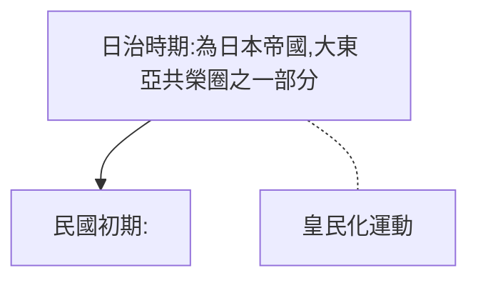

# 歷史解釋_認同問題

### 認同取決於?
個人對群體的認同多產生於統治者對該族群/有關事件的詮釋。而統治者往往會在詮釋中加入自己的利益與觀點，導致在每個時代，民眾對同一事件的想法會截然不同。
### 台灣認同是什麼?
台灣也如同大多數地區一樣，每次改朝換代/更換執政黨，對政治敏感事件的解釋都會有所差異。近年來推動轉型正義，逐漸改變各族群對自我的認同。
>**認同應是自己的自我認同，而不是淪為統治者的工具!!!**
### 台灣認同演變

### 日治時期_原住民
- [[花岡一郎與花岡二郎]]事件
	- 血統與忠誠
- 霧社事件
	- 勞役與服從
- [[高砂義勇隊]]
	- 新一代原住民認為自己是日本人，進而願意為「國家」犧牲