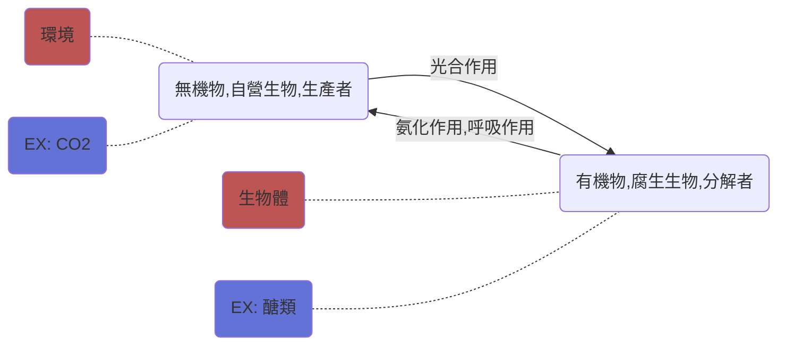
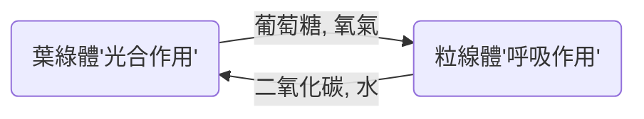

# 細胞與能量
#生物
# Notes

Topic: 細胞與能量
Date: 20210825
Course: 
Class: 海山E學院

---
### Notes
- 生態系中物質的轉換

```mermaid
graph LR
id1(無機物,自營生物,生產者)
id4(有機物,腐生生物,分解者)
id1 -->|光合作用| id4
id4 -->|氨化作用,呼吸作用| id1
id2(環境)
id3(生物體)
id2 -.- id1
id3 -.- id4
style id2 fill:#bd5555
style id3 fill:#bd5555
id5(EX: CO2)
id6(EX: 醣類)
id5 -.- id1
id6 -.- id4
style id5 fill:#6372d6
style id6 fill:#6372d6
```
---

```mermaid
graph LR
id1(葉綠體'光合作用') -->|葡萄糖, 氧氣| id2(粒線體'呼吸作用')
id2 -->|二氧化碳, 水| id1
```
---
### Summary
Highlight     ==what’s important!==

#### 
