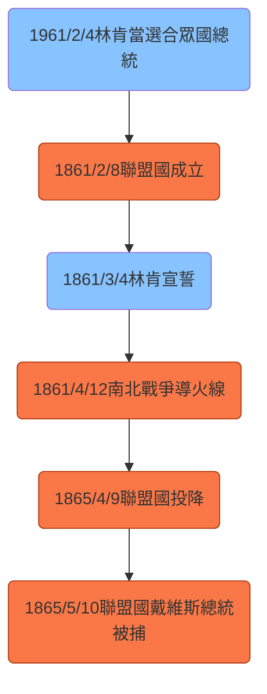

# 美利堅聯盟國
#歷史 #地理
![[1024px-Flag_of_the_Confederate_States_of_America_(1865).svg.png]]
![[1024px-Flag_of_the_Confederate_States_of_America_(March_1861_–_May_1861).svg.png]]

**首都**: 阿拉巴馬州蒙哥馬利(Montgomery)->維吉尼亞州里奇蒙(Richmond)->維吉尼亞州丹維爾(Danville)

**存在時間**: 1861/2/8~1865/5/5

**立場**: 支持奴隸制(但禁止國際奴隸交易)、州政府權力大於中央政府權力

**重要事件**: [[南北戰爭]](1861~1865)

美利堅聯盟國（the Confederate States of America，CSA），簡稱邦聯。是自1861年至1865年由美國南方蓄奴州宣布從美利堅合眾國分裂而出的政權。自美利堅聯盟國單方面獨立後，大部分時間都在與北方亞伯拉罕·林肯領導的合眾國政府進行內戰，大多處於防禦態勢，只有羅伯特·李將軍麾下的北維吉尼亞軍團曾短暫的入侵合眾國領土。1865年聯盟國在[[南北戰爭]]中失利而被合眾國併吞，美國重新統一。

1861年2月4日，在確知亞伯拉罕·林肯當選為合眾國總統後，美國南部七個蓄奴州先後脫離合眾國。2月8日，宣布成立美利堅聯盟國，次日選出傑佛遜·戴維斯為首任美利堅邦聯總統。 這七州脫離合眾國並控制境內的海陸軍、港口與海關，從而引爆了[[南北戰爭]]。

一個月之後，林肯於1861年3月4日宣誓就職為美國總統。在就職演說中，他指出美國憲法比先前的邦聯條例勾勒出「更完整的聯邦」，為具約束力的章程，而南方的分離為「無法律效力」。他表示無意入侵南方諸州，但將動用武力以維護美國所轄的機關與領土。他的演說以呼籲美國歸一作結。

4月12日，南卡羅萊那州向內駐查爾斯頓桑特堡的合眾國軍隊開火，迫其投降。桑特堡戰役後，林肯召請美國國內其他州發兵奪回桑特堡與其他要塞，保衛首都，並維護美國。大多數的北方州相信，合眾國可速戰速決，故林肯僅徵求志願兵作戰90天，結果導致維吉尼亞州、阿肯色州、田納西州、與北卡羅萊那州表決脫離美國聯邦。在維吉尼亞州加入後，邦聯將首都從阿拉巴馬州蒙哥馬利遷至維吉尼亞州的里奇蒙。密蘇里州與肯塔基州雖繼續留在合眾國內，但兩州內的敵對派系被邦聯招攬，所以邦聯成員州有時被視為13個。

蓄奴州並未全部加入邦聯。1861年馬里蘭州宣布軍事戒嚴以防止脫離合眾國。同樣也是蓄奴州的德拉瓦州則從未考慮過脫離。在戰爭期間，維吉尼亞州支持合眾國的議會於1863年主張西部48郡加入合眾國，成為西維吉尼亞州，其州憲為漸進廢除奴隸制。

1865年4月9日，[[羅伯特·李]]將軍麾下的北維吉尼亞軍團在阿波馬托克斯鎮投降，一般視其為美利堅邦聯的終結日。戴維斯總統於5月10日在喬治亞州的歐文維爾被捕。

Links:[[美國各州加入聯邦順序]]、[[美國擴張史]]

Source: 
[美利堅邦聯 - Wikiwand](https://www.wikiwand.com/zh-tw/%E7%BE%8E%E5%88%A9%E5%A0%85%E8%81%AF%E7%9B%9F%E5%9C%8B)

#### 202107291506