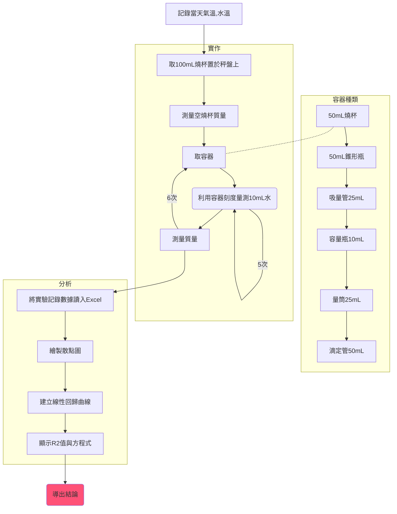

# 自然探究與實作_水密度測量_流程

```mermaid
graph TD
記錄當天氣溫,水溫-->取100mL燒杯置於秤盤上
subgraph 容器種類
50mL燒杯-->50mL錐形瓶-->吸量管25mL-->容量瓶10mL-->量筒25mL-->滴定管50mL
end
subgraph 實作
取100mL燒杯置於秤盤上-->測量空燒杯質量-->取容器
取容器-->id1(利用容器刻度量測10mL水)-->測量質量
id1-->|5次|id1
50mL燒杯-.-取容器
測量質量-->|6次|取容器
end
測量質量-->將實驗記錄數據讀入Excel
subgraph 分析
將實驗記錄數據讀入Excel-->繪製散點圖-->建立線性回歸曲線-->顯示R2值與方程式
end
顯示R2值與方程式-->id2(導出結論)
style id2 fill:#FF5177
```