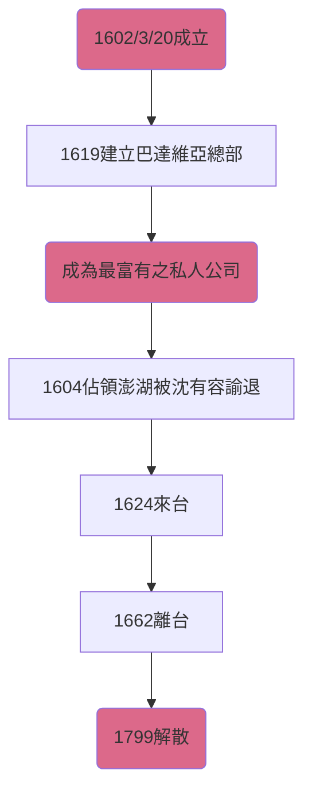

# 荷蘭東印度公司
![[440px-VOC.svg.png]]
### 簡稱: $V_OC$
###
### 創立: 
由威尼斯取得之香料過於昂貴，歐洲各國都積極向東發展，建立海外貿易公司。荷蘭先後共組建了14間船隊公司，但因惡性競爭，後合併為荷蘭東印度公司。
### 特權: 
- 從非洲好望角至南美洲麥哲倫海峽，具有**貿易壟斷權**
- **審判犯人並判刑之權利**
- 可與其他國家**談判、議和、宣戰**
- 可**發行自有貨幣**
- 可**建立殖民地與軍事要塞**
### 總部: 
- 歐洲
	- 阿姆斯特丹
- 亞洲
	- 巴達維亞(今印尼雅加達)
### 解體
因18世紀末荷、英兩國戰爭，且法國大革命革命軍佔領荷蘭，民眾對東亞之商品需求銳減，故最後於1799年解散。
### 重要事件年表:

