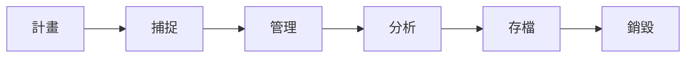

# 資料分析
#coursera 
#### 順序
- 收集資料
	- 整理資料
	- 得到結論
	- 做出預測
	- 做決定
		- 利用分析出的事實以引導企業經營策略
			- 找到問題點
			- 加入專家意見
				- Subject matter experts

#### 定義
- 把資料轉換成能影響決策的資訊
	- 與其他專有名詞不同處
		- 資料分析 Data analysis
			- 利用資料解決已知問題
		- 資訊科學 Data science
			- 利用原始資料創造理解未知的新方法
		- 資料分析(2) Data analytics
			- 解析資料以預測未來模式並加以應對
			- 最廣義

#### 資料分析步驟	
- Google
	- 詢問 ask
		-  找出問題
		- 了解經營者需求
		- 確定負擔風險的人是誰
	- 準備 prepare
		- 找資料
	- 處理 process
		- 資料清理
		- 合併資料以使其更完整	
	-  分析 analysis
		- 試算表
		- [[SQL]]
	- 分享 share
		- 使經營者能做出有根據的決
		- 資料視覺化
		-  簡報
	- 行動 act
		- 解決問題
- Dell EMC
	- 發現 Discovery
	- 資料前處理 Pre-processing data
	- 計畫模型 Model planning
	- 建造模型 Model building
	- 溝通結果 Communicate results
	- 執行 Operationalize
- SAS
	- 詢問 Ask
	- 準備 Prepare
	- 探索 Explore
	- 建模 Model
	- 實施 Implement
	- 行動 Act
	- 評價 Evaluate
- 簡單分析
	- 找出問題
	- 設計資料需求
	- 資料前處理
	- 資料分析
	- 資訊圖像化	
-  大數據分析
	- 處理企業問題
	- 資料辨識
	- 資料篩選
	- 資料抽取
	- 資料清理
	- 找出代表性資料
	- 資料分析
	- 資訊圖像化
	- 分析結果利用率

#### 資料定義
- 事實的集合
- 資料本身永遠比不上"資料加上人類經驗"

#### 公司利用資料做...
- 改進流程
- 辨識流行與機會
- 做有有根據的決定
- 服務客戶
- 推出新產品

#### 資料分析包含

- 機器學習、人工智慧
	- 以未知資料做大量決定
- 分析
	- 找到資料的用途
- 統計
	- 以未知資料做少量決定
	- 不要太講求完美
		- 重要的是趨勢

#### 資訊生態系 Data ecosytems
- 各種元素為了其功能而互相互動
	- 功能
		- 生產資料
		- 管理資料
		- 儲存資料
		- 整理資料
		- 分析資料
		- 分享資料
-  包含
	- 軟體
		- "雲" Cloud
			- 線上處理資料
	- 硬體
	- 人

#### 資料分析師特質
- 好奇心
- 了解內容
- 資料設計
- 資料策略
- 有關連不一定是因果關係
- 分析技術

#### 資料生命週期

#### 資料分析工具
- 試算表
	- Excel
	- Google Sheets
	- 收集、儲存、整理資料
	- 了解資料趨勢
	- 資料視覺化
	- 名詞
		- 格 Cells
		- 直行 Columns	
			- 字母編號
		- 橫列 Rows/Observation	
			- 數字編號
		- 標籤/行標題 Attributes/Headers
- [[SQL]]
	- 使用簡單
	- 可與大部分資料庫合作
	- 工具
		- MySQL
		- Microsoft [[SQL]] Server
		- BigQuery
	- 隔離特定資料
	- 命令
		- SELECT
			- 想要尋找的欄位
		- FROM
			- 要尋找資料的資料庫
		- WHERE
			- 篩選器
		- CREATE 創立資料/資料庫
		- COLLATE 編碼
			- 中文 utf8mb4_unicode_ci
		- DROP 刪除(一整個資料/資料庫)
		- DELETE FROM 刪除資料(資料庫中某一數據)
		- ALTER+ADD/DROP 資料庫建立後新增/刪除欄位
		- INSERT INTO 資料表名稱 VALUES(資料,資料,資料)
		- AND 多重條件
		- ORDER BY 排序
			- DESC 由大到小
			- ASC 由小到大
		- GROUP BY 資料分群
		- UPDATE 更新資料
		- START TRANSACTION 開始包裝以下程式
		- COMMIT 提交
			- 一定要完成提交才會修改成功
		- ROLLBACK 取消操作(操作不對原始資料造成影響)
		- GRANT 授權使用者權限
			- GRANT 想要給其他使用者之權限 TO
		- REVOKE 取消使用者權限
		- 函式
			- COUNT 數量
			- SUM 加總
			- AVG 平均值
			- MAX 最大值
			- MIN 最小值
	- 變量
		- VARCHAR 可變長度字串
		- INTEGER 整數
		- NOT NULL 此欄不能為空
	- 重要語法
		- 每句以分號作結束
			- ;
		- 星號代表所有
			- \*

#### 資訊視覺化工具
- Tableau
	- 互動式
- Looker
	- 與資料庫直接相連

#### 202108101737
