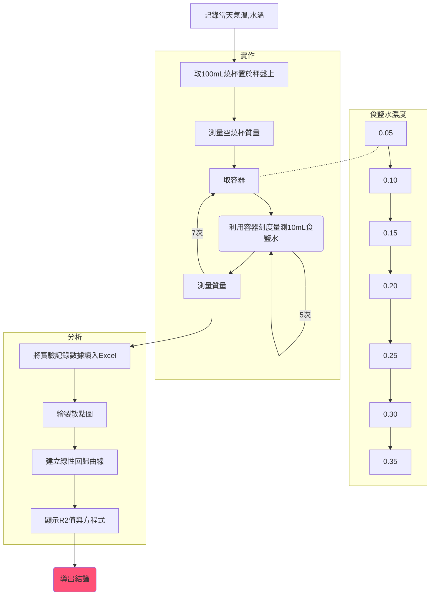

# 食鹽水密度預報
#自然探究實做 
### 食鹽特性: 
- 式量:35.45
- Sodium chloride
- NaCl
- 白色或無色晶體或粉末
- 2.17 $g/cm^2$
- 熔點 802.18$^oC$
- 沸點 1465$^oC$
- 25$^oC$對水溶解度: 36g/100g水
- 晶體結構: 面心立方體結構
- NFPA704: 0-0-0

 ### 目的:
 了解食鹽水的密度與濃度的關聯，並拿到成績不被當。
 同時增進我們的科學知識與實驗分析技巧。
 
 ### 原理:
 氯化鈉會溶解於一氧化二氫之中。
 三樑天平原理: 地球引力+待測物質量+砝碼質量。
 線性回歸原理:  電腦依數據分析找出一條最平均的直線，並分析他的誤差值平方($R^2$值)
 
 ### 流程:

